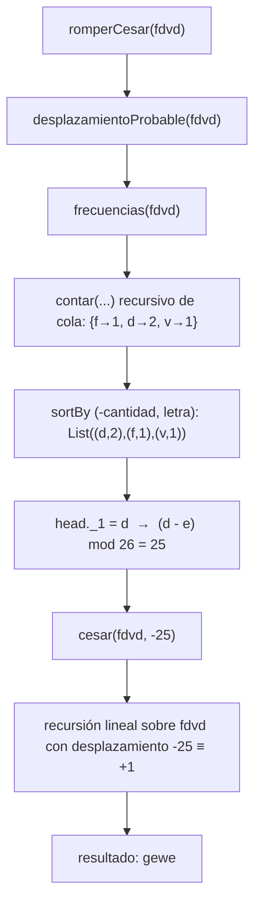

# Informe de corrección — Cifrados clásicos con recursión

## 1. Cómo se argumenta la corrección

Para cada función $P_f$ con especificación $f : A \to B$ debemos probar

$$
\forall a \in A : \; P_f(a) = f(a).
$$

Se usan dos herramientas:

- **Inducción estructural / matemática** sobre la longitud del mensaje (o sobre $n$): *base de inducción → hipótesis de inducción → paso inductivo*.
- **Invariante del acumulador** para las funciones recursivas de cola: se prueba una afirmación general sobre *todo* valor del acumulador, y de ella se deduce el resultado con el acumulador inicial.

En todos los casos se justifica además la **terminación** con una medida que decrece (la longitud del mensaje restante, o $n$).

### 1.1 Notación

- $\Sigma = \{a, b, \dots, z\}$ es el conjunto de las 26 letras minúsculas.
- $\varepsilon$ es el mensaje vacío; $xy$ es la concatenación de $x$ e $y$; $\lvert m \rvert$ es la longitud de $m$.
- Un mensaje no vacío se escribe $m = c\,r$, con $c$ el primer carácter (`m.head`) y $r$ el resto (`m.tail`).
- $\mathrm{pos}(c) = c - \texttt{'a'} \in \{0,\dots,25\}$ para $c \in \Sigma$, y $\mathrm{chr}$ es su inversa.
- $x \bmod 26$ es el **residuo matemático**, siempre en $\{0,\dots,25\}$. (El operador `%` de Scala puede dar negativos; se trata en el Lema 1.)
- El desplazamiento de un carácter $c$ por $k \in \mathbb{Z}$ es

$$
s_k(c) =
\begin{cases}
\mathrm{chr}\big((\mathrm{pos}(c) + k) \bmod 26\big) & \text{si } c \in \Sigma \\
c & \text{si } c \notin \Sigma
\end{cases}
$$

- El cifrado César de un mensaje $m = m_0 m_1 \cdots m_{n-1}$ es la aplicación carácter a carácter

$$
C_k(m) = s_k(m_0)\, s_k(m_1) \cdots s_k(m_{n-1}).
$$

### 1.2 Lemas auxiliares

**Lema 1 (el `%` de Scala).** Para todo entero $x$:

$$
\big((x \;\texttt{\%}\; 26) + 26\big)\;\texttt{\%}\;26 = x \bmod 26.
$$

*Demostración.* En Scala, $r = x\;\texttt{\%}\;26$ cumple $-26 < r < 26$ y $r \equiv x \pmod{26}$. Entonces $r + 26 \in (0, 52)$ es positivo y $r + 26 \equiv x \pmod{26}$. Para un entero positivo, `%` coincide con el residuo matemático, así que $(r+26)\;\texttt{\%}\;26 \in \{0,\dots,25\}$ y es congruente con $x$ módulo 26. Hay un único número en ese rango con esa propiedad: $x \bmod 26$. $\square$

(Se supone que no hay desbordamiento de `Int`, es decir $\lvert k \rvert$ razonablemente menor que $2^{31}$.)

**Lema 2 ($C_k$ respeta la concatenación).** Para todos $x, y$: $C_k(xy) = C_k(x)\,C_k(y)$. En particular

$$
C_k(\varepsilon) = \varepsilon, \qquad C_k(c\,r) = s_k(c)\, C_k(r).
$$

*Demostración.* $C_k$ aplica $s_k$ a cada posición de forma independiente. $\square$

**Lema 3 (composición de desplazamientos).** Para todo carácter $c$ y enteros $j, k$: $s_j(s_k(c)) = s_{j+k}(c)$ y $s_0(c) = c$. Por tanto

$$
C_j(C_k(m)) = C_{j+k}(m), \qquad C_{-k}(C_k(m)) = C_0(m) = m.
$$

*Demostración.* Si $c \notin \Sigma$ ambos lados son $c$. Si $c \in \Sigma$, $s_k(c) \in \Sigma$ y
$\mathrm{pos}(s_j(s_k(c))) = ((\mathrm{pos}(c)+k) \bmod 26 + j) \bmod 26 = (\mathrm{pos}(c)+j+k) \bmod 26$.
Para $s_0$: $\mathrm{pos}(c) \bmod 26 = \mathrm{pos}(c)$. El resultado para mensajes sigue del Lema 2. $\square$

**Lema 4 ($s_k$ es una biyección de $\Sigma$).** $s_k$ permuta las letras (su inversa es $s_{-k}$). Por eso, el número de apariciones de $s_k(l)$ en $C_k(M)$ es igual al número de apariciones de $l$ en $M$.

---

## 2. Corrección de `cesar` (recursión lineal)

```scala
def cesar(m: Mensaje, k: Int): Mensaje = {
  def cifrar(c: Char): Char = {
    if (esMinuscula(c)) {
      val pos = c - 'a'
      val nuevo = ((pos + k) % 26 + 26) % 26
      ('a' + nuevo).toChar
    } else c
  }
  if (m.isEmpty) "" else cifrar(m.head) + cesar(m.tail, k)
}
```

**Especificación.** $\forall m \in \text{Mensaje},\ \forall k \in \mathbb{Z}$: $\ \texttt{cesar}(m,k) = C_k(m)$.

**Paso previo: `cifrar(c)` $= s_k(c)$.** Si $c \notin \Sigma$ devuelve $c = s_k(c)$. Si $c \in \Sigma$, devuelve `'a' + nuevo` con $\texttt{nuevo} = ((\mathrm{pos}(c)+k)\;\texttt{\%}\;26+26)\;\texttt{\%}\;26 = (\mathrm{pos}(c)+k) \bmod 26$ por el Lema 1; es decir, $s_k(c)$.

**Terminación.** Cada llamada recursiva recibe `m.tail`, de longitud $\lvert m \rvert - 1$. La medida $\lvert m \rvert \in \mathbb{N}$ decrece estrictamente y el caso `m.isEmpty` la detiene.

Se prueba por inducción sobre $n = \lvert m \rvert$ (con $k$ fijo y arbitrario).

**Base de inducción ($n = 0$).** $m = \varepsilon$. El programa entra en `m.isEmpty` y devuelve $\varepsilon$. Por el Lema 2, $C_k(\varepsilon) = \varepsilon$. Luego $\texttt{cesar}(\varepsilon, k) = C_k(\varepsilon)$.

**Hipótesis de inducción.** Para todo mensaje $r$ con $\lvert r \rvert = n$: $\ \texttt{cesar}(r,k) = C_k(r)$.

**Paso inductivo.** Sea $m = c\,r$ con $\lvert r \rvert = n$, de modo que $\lvert m \rvert = n+1$. Como `m` no es vacío, el programa devuelve `cifrar(c) + cesar(r, k)`:

$$
\begin{aligned}
\texttt{cesar}(c\,r, k)
&= \texttt{cifrar}(c)\; \texttt{cesar}(r,k) && \text{(definición del programa)}\\
&= s_k(c)\; \texttt{cesar}(r,k) && \text{(paso previo)}\\
&= s_k(c)\; C_k(r) && \text{(hipótesis de inducción)}\\
&= C_k(c\,r) && \text{(Lema 2)}.
\end{aligned}
$$

Por inducción, $\forall m: \texttt{cesar}(m,k) = C_k(m)$. $\blacksquare$

**Encadenamiento de llamados** para `cesar("casa", 3)`. Cada llamada deja pendiente la concatenación con el resultado de la siguiente:

$$
\begin{aligned}
\texttt{cesar}(\texttt{casa},3) &= \texttt{'f'} + \texttt{cesar}(\texttt{asa},3)\\
&= \texttt{'f'} + \big(\texttt{'d'} + \texttt{cesar}(\texttt{sa},3)\big)\\
&= \texttt{'f'} + \big(\texttt{'d'} + (\texttt{'v'} + \texttt{cesar}(\texttt{a},3))\big)\\
&= \texttt{'f'} + \big(\texttt{'d'} + (\texttt{'v'} + (\texttt{'d'} + \texttt{cesar}(\varepsilon,3)))\big)\\
&= \texttt{'f'} + \big(\texttt{'d'} + (\texttt{'v'} + (\texttt{'d'} + \texttt{""}))\big) = \texttt{fdvd}.
\end{aligned}
$$

Los $n+1$ llamados quedan apilados hasta llegar al caso base y luego se resuelven de adentro hacia afuera. Esto es lo que la inducción formaliza: la hipótesis es exactamente "el llamado interno ya devolvió $C_k(r)$".

---

## 3. Corrección de `cesarCola` (recursión de cola)

```scala
@tailrec
final def cesarCola(m: Mensaje, k: Int, acc: Mensaje = ""): Mensaje = {
  if (m.isEmpty) acc
  else {
    val c = m.head
    val cCifrado = if (esMinuscula(c)) {
      val desplazamiento = ((c.toInt - primera + k) % letras + letras) % letras
      (desplazamiento + primera).toChar
    } else c
    cesarCola(m.tail, k, acc + cCifrado)
  }
}
```

Con `primera` $= \texttt{'a'}$ y `letras` $= 26$, `cCifrado` $= s_k(c)$ por el mismo argumento del Lema 1.

**Afirmación general (invariante).** Para todo mensaje $m$ y todo acumulador $acc$:

$$
\texttt{cesarCola}(m, k, acc) = acc \cdot C_k(m).
$$

Equivalente a la invariante $acc \cdot C_k(m) = C_k(M)$ a lo largo de la ejecución, donde $M$ es el mensaje original: $acc$ es lo ya cifrado y $m$ lo que falta.

**Terminación.** La medida $\lvert m \rvert$ decrece en 1 en cada llamada.

Se prueba por inducción sobre $n = \lvert m \rvert$, para **todo** $acc$ a la vez.

**Base de inducción ($n = 0$).** $m = \varepsilon$: el programa devuelve $acc$. Y $acc \cdot C_k(\varepsilon) = acc \cdot \varepsilon = acc$.

**Hipótesis de inducción.** Para todo $r$ con $\lvert r \rvert = n$ y **todo** acumulador $acc'$: $\ \texttt{cesarCola}(r,k,acc') = acc' \cdot C_k(r)$.

**Paso inductivo.** Sea $m = c\,r$ con $\lvert r \rvert = n$ y $acc$ arbitrario:

$$
\begin{aligned}
\texttt{cesarCola}(c\,r, k, acc)
&= \texttt{cesarCola}(r, k, acc \cdot s_k(c)) && \text{(definición del programa)}\\
&= (acc \cdot s_k(c)) \cdot C_k(r) && \text{(hipótesis, con } acc' = acc\cdot s_k(c))\\
&= acc \cdot \big(s_k(c)\, C_k(r)\big) && \text{(asociatividad de la concatenación)}\\
&= acc \cdot C_k(c\,r) && \text{(Lema 2)}.
\end{aligned}
$$

Es crucial que la hipótesis valga **para todo acumulador**: en el paso se aplica con un acumulador distinto, $acc \cdot s_k(c)$.

**Corolario.** Con $acc = \varepsilon$ (valor por defecto): $\texttt{cesarCola}(M,k) = \varepsilon \cdot C_k(M) = C_k(M) = \texttt{cesar}(M,k)$ para toda entrada. $\blacksquare$

**Por qué es de cola.** En el caso recursivo, la llamada a `cesarCola` es la **última** operación: no queda nada por hacer cuando regresa (la concatenación `acc + cCifrado` se evalúa *antes* de llamar). Por eso `@tailrec` la compila a un ciclo y el espacio de pila es constante.

**Encadenamiento de llamados** para `cesarCola("casa", 3)`. Cada fila reemplaza a la anterior (un único marco):

| Llamado | `m` | `acc` |
|---|---|---|
| 0 | `casa` | `""` |
| 1 | `asa` | `f` |
| 2 | `sa` | `fd` |
| 3 | `a` | `fdv` |
| 4 | `""` | `fdvd` → **resultado** |

En cada fila se cumple $acc \cdot C_3(m) = \texttt{fdvd} = C_3(\texttt{casa})$.

---

## 4. Corrección de `frecuencias`

La función recorre el mensaje con una auxiliar `contar(mensaje, frecuenciasActuales)` de cola, y luego ordena con `sortBy { case (letra, cantidad) => (-cantidad, letra) }`.

**Especificación.** Para un mensaje $m$ sea $F(m) : \Sigma \to \mathbb{N}$ con

$$
F(m)(l) = \big\lvert \{\, i : m_i = l \,\}\big\rvert .
$$

Un `Map[Char, Int]` $A$ representa la función $[\![A]\!](l) = $ `A.getOrElse(l, 0)`. Sea $\delta_c$ la función que vale 1 en $c$ y 0 en las demás letras.

El resultado esperado de `frecuencias(m)` es la lista de pares $(l, F(m)(l))$ con $F(m)(l) > 0$, ordenada por cantidad decreciente y, en empate, por letra creciente.

### 4.1 Corrección del conteo

**Afirmación.** Para todo mensaje $m$ y todo mapa $A$ cuyas claves sean letras:

$$
[\![\texttt{contar}(m, A)]\!] = [\![A]\!] + F(m) \quad \text{(suma punto a punto)}.
$$

**Terminación.** La medida $\lvert m \rvert$ decrece en 1 por llamada.

Se prueba por inducción sobre $n = \lvert m \rvert$, para todo $A$.

**Base de inducción ($n=0$).** $m=\varepsilon$: devuelve $A$. Como $F(\varepsilon) = 0$, $[\![A]\!] = [\![A]\!] + F(\varepsilon)$.

**Hipótesis de inducción.** Para todo $r$ con $\lvert r \rvert = n$ y todo mapa $A'$: $[\![\texttt{contar}(r,A')]\!] = [\![A']\!] + F(r)$.

**Paso inductivo.** Sea $m = c\,r$. Observamos que $F(c\,r) = \delta_c + F(r)$ si $c \in \Sigma$, y $F(c\,r) = F(r)$ si $c \notin \Sigma$.

- *Caso $c \in \Sigma$.* El programa llama a `contar(r, A')` con $A' = A + (c \mapsto [\![A]\!](c)+1)$, es decir $[\![A']\!] = [\![A]\!] + \delta_c$. Entonces
  $$
  [\![\texttt{contar}(c\,r, A)]\!] = [\![A']\!] + F(r) = [\![A]\!] + \delta_c + F(r) = [\![A]\!] + F(c\,r).
  $$
- *Caso $c \notin \Sigma$.* El programa llama a `contar(r, A)` sin cambios:
  $$
  [\![\texttt{contar}(c\,r, A)]\!] = [\![A]\!] + F(r) = [\![A]\!] + F(c\,r).
  $$

Esto completa la inducción. Con $A = \varnothing$ (donde $[\![\varnothing]\!] = 0$) se obtiene $[\![\texttt{contar}(m,\varnothing)]\!] = F(m)$. Además, una letra solo entra al mapa cuando se le suma 1, así que las letras con $F(m)(l) = 0$ **no aparecen** como clave, y los caracteres fuera de $\Sigma$ nunca entran.

### 4.2 Corrección del ordenamiento

La lista obtenida del mapa contiene un par $(l, F(m)(l))$ por cada letra presente, con letras **distintas**. La clave de ordenamiento $(-\text{cantidad},\ \text{letra})$ (orden lexicográfico) es entonces **inyectiva** sobre esos pares, y por tanto define un orden total estricto. Existe una única permutación ordenada, y es la que pone primero la mayor cantidad y, a igual cantidad, la letra menor. Es exactamente la especificación. $\blacksquare$

**Encadenamiento de llamados** para `frecuencias("casa")`:

| Llamado | `mensaje` | mapa acumulado |
|---|---|---|
| 0 | `casa` | `{}` |
| 1 | `asa` | `{c→1}` |
| 2 | `sa` | `{c→1, a→1}` |
| 3 | `a` | `{c→1, a→1, s→1}` |
| 4 | `""` | `{c→1, a→2, s→1}` → se devuelve |

Luego se ordena por $(-\text{cantidad}, \text{letra})$: claves $(-2,a), (-1,c), (-1,s)$, resultado `List(('a',2), ('c',1), ('s',1))`.

---

## 5. Corrección de `desplazamientoProbable`

```scala
def desplazamientoProbable(m: Mensaje): Int = {
  val frecs = frecuencias(m)
  if (frecs.isEmpty) 0
  else {
    val letraMasFrecuente = frecs.head._1
    ((letraMasFrecuente - 'e') % 26 + 26) % 26
  }
}
```

**Especificación.** Sea $f(m)$ la **primera** letra de `frecuencias(m)`: la de mayor frecuencia y, entre empatadas, la menor alfabéticamente (por la sección 3). El desplazamiento estimado es

$$
\hat{k}(m) =
\begin{cases}
0 & \text{si } m \text{ no tiene letras}\\
(\mathrm{pos}(f(m)) - 4) \bmod 26 & \text{en otro caso}
\end{cases}
$$

(porque $\mathrm{pos}(\texttt{'e'}) = 4$).

**Demostración (no hay recursión propia).** Si no hay letras, `frecuencias(m)` $=$ `List()` (sección 3) y el programa devuelve 0. En otro caso, `frecs.head._1` es $f(m)$ por la sección 3, y como $f(m) - \texttt{'e'} = \mathrm{pos}(f(m)) - 4$, el Lema 1 da que el programa devuelve $(\mathrm{pos}(f(m)) - 4) \bmod 26 = \hat{k}(m)$. $\blacksquare$

**Proposición (cuándo la estimación acierta).** Sea $m = C_k(M)$. Si $f(m) = s_k(\texttt{'e'})$, entonces $\hat{k}(m) = k \bmod 26$.

*Demostración.* $\mathrm{pos}(s_k(\texttt{'e'})) = (4+k) \bmod 26$, así que $\hat{k} = ((4+k) \bmod 26 - 4) \bmod 26 = k \bmod 26$. $\square$

**Cuándo se cumple la hipótesis $f(m) = s_k(\texttt{'e'})$.** Por el Lema 4, la frecuencia de $s_k(l)$ en $m$ es la de $l$ en $M$. Si en $M$ la letra `e` tiene frecuencia **estrictamente mayor** que cualquier otra, entonces $s_k(\texttt{'e'})$ es la única de mayor frecuencia en $m$, y es la cabeza de la lista. Si hay empates en el máximo, decide el orden alfabético de las letras **cifradas**, no el de las originales.

---

## 6. Corrección de `romperCesar` y sus condiciones de falla

```scala
def romperCesar(m: Mensaje): Mensaje = {
  val desplazamiento = desplazamientoProbable(m)
  cesar(m, -desplazamiento)
}
```

**Teorema.** Para todo mensaje $M$ y todo $k \in \mathbb{Z}$, sea $m = C_k(M)$ y $\hat{k} = \hat{k}(m)$. Entonces

$$
\texttt{romperCesar}(C_k(M)) = C_{k-\hat{k}}(M).
$$

*Demostración.*

$$
\begin{aligned}
\texttt{romperCesar}(m) &= \texttt{cesar}(m, -\hat{k}) && \text{(definición y sección 4)}\\
&= C_{-\hat{k}}(m) && \text{(corrección de cesar, sección 1)}\\
&= C_{-\hat{k}}(C_k(M)) = C_{k-\hat{k}}(M) && \text{(Lema 3)}. \qquad\square
\end{aligned}
$$

**Corolario (exactitud).** $\texttt{romperCesar}(C_k(M)) = M$ si y solo si $\hat{k} \equiv k \pmod{26}$, o $M$ no tiene letras.

*Demostración.* Si $\hat k \equiv k$, entonces $k - \hat{k} \equiv 0$ y $C_0(M) = M$. Si $M$ no tiene letras, $C_j(M) = M$ para todo $j$. Recíprocamente, si $M$ tiene alguna letra $l$ y $k - \hat{k} \not\equiv 0 \pmod{26}$, entonces $s_{k-\hat{k}}(l) \neq l$ y el resultado difiere de $M$. $\square$

En particular, el método **acierta** cuando `e` es la letra estrictamente más frecuente del mensaje original (Proposición de la sección 4).

### 6.1 Condiciones en que el método falla

El método falla exactamente cuando la letra que `frecuencias` pone de primera en el texto cifrado **no** es la imagen de `e`. Casos típicos:

1. **Textos cortos o atípicos:** con pocas letras, la frecuencia observada se aleja de la del idioma.
2. **Textos donde otra letra domina** (por ejemplo una palabra repetida sin `e`, o un texto en otro idioma).
3. **Empates en el máximo:** gana la letra cifrada menor alfabéticamente, que puede no ser la imagen de `e`.

### 6.2 Mensajes concretos donde falla

**Contraejemplo 1 (otra letra domina).** $M = \texttt{casa}$, $k = 3$.

- $C_3(M) = \texttt{fdvd}$, con frecuencias $d{:}2,\ f{:}1,\ v{:}1$. Luego $f(m) = \texttt{d}$ y $\hat{k} = (3 - 4) \bmod 26 = 25$.
- Por el Teorema: $\texttt{romperCesar}(\texttt{fdvd}) = C_{3-25}(\texttt{casa}) = C_{-22}(\texttt{casa}) = C_{4}(\texttt{casa}) = \texttt{gewe}$.

Se obtiene `gewe`, que es distinto de `casa`, porque $\hat{k} = 25 \neq 3$.

**Contraejemplo 2 (empate en el máximo).** $M = \texttt{eezz}$, $k = 3$.

- $C_3(M) = \texttt{hhcc}$, con frecuencias $c{:}2,\ h{:}2$. Empatan y gana la menor alfabéticamente, `c`. Luego $\hat{k} = (2-4) \bmod 26 = 24$.
- $\texttt{romperCesar}(\texttt{hhcc}) = C_{3-24}(\texttt{eezz}) = C_{5}(\texttt{eezz}) = \texttt{jjee}$.

Se obtiene `jjee` $\neq$ `eezz`, aunque `e` es una de las letras más frecuentes de $M$: el empate se resolvió en favor de la letra equivocada.

### 6.3 Encadenamiento de llamados de `romperCesar("fdvd")`



---

## 7. Corrección de `combinaciones`

```scala
def combinaciones(n: Int, a: Int): BigInt = {
  if (n == 0) BigInt(1)
  else if (n == 1) BigInt(a)
  else BigInt(a - 1) * combinaciones(n - 1, a)
}
```

**Especificación.**

$$
C(0,a) = 1, \qquad C(1,a) = a, \qquad C(n,a) = (a-1)\,C(n-1,a) \ \ (n>1).
$$

**Terminación.** Para $n > 1$ la llamada es con $n-1 \geq 1$; la medida $n \in \mathbb{N}$ decrece y se alcanza $n = 1$.

**Afirmación.** $\forall n \geq 0:\ \texttt{combinaciones}(n,a) = C(n,a)$ (con $a$ fijo).

Se prueba por inducción sobre $n$, con dos casos base.

**Base de inducción.**
- $n = 0$: el programa devuelve $1 = C(0,a)$.
- $n = 1$: el programa devuelve $a = C(1,a)$.

**Hipótesis de inducción.** Para un $k \geq 1$ fijo: $\texttt{combinaciones}(k,a) = C(k,a)$.

**Paso inductivo.** Veamos $n = k+1 \geq 2$. Como $n > 1$, el programa toma el caso recursivo:

$$
\begin{aligned}
\texttt{combinaciones}(k+1,a)
&= (a-1)\cdot\texttt{combinaciones}(k,a) && \text{(definición del programa)}\\
&= (a-1)\cdot C(k,a) && \text{(hipótesis de inducción)}\\
&= C(k+1,a) && \text{(definición de } C).
\end{aligned}
$$

(La hipótesis se usa a partir de $k = 1$, ya cubierto por la base; así el paso para $n=2$ apoya en $n=1$.) $\blacksquare$

**Forma cerrada.** Para $n \geq 1$: $C(n,a) = a\,(a-1)^{n-1}$. Se verifica por inducción: $n=1$ da $a$; y si vale para $k$, entonces $C(k+1,a) = (a-1)\,a\,(a-1)^{k-1} = a\,(a-1)^{k}$. Ejemplo: $C(3,26) = 26 \cdot 25^2 = 16250$.

**Encadenamiento de llamados** para `combinaciones(3, 26)`:

$$
\begin{aligned}
\texttt{comb}(3,26) &= 25 \cdot \texttt{comb}(2,26)\\
&= 25 \cdot \big(25 \cdot \texttt{comb}(1,26)\big)\\
&= 25 \cdot (25 \cdot 26) = 16250.
\end{aligned}
$$

---

## 8. Corrección de `vigenere`

Se usa el siguiente comportamiento del programa (según el enunciado y la implementación):

- Mensaje vacío → `""`. Clave vacía → el mensaje sin cambios.
- Si `m.head` $= c \in \Sigma$ y la clave $q$ es no vacía: se emite $s_{\mathrm{pos}(q_0)}(c)$ y se continúa con `m.tail` y la clave **rotada** $\mathrm{rot}(q) = $ `clave.tail + clave.head`.
- Si $c \notin \Sigma$: se emite $c$ y se continúa con `m.tail` y la **misma** clave.

### 8.1 Especificación

Sea $q = q_0 q_1 \cdots q_{p-1}$ una clave no vacía de letras. La $i$-ésima **letra** de $m$ (contando desde 0 y solo letras; los demás caracteres no cuentan) se desplaza por $\mathrm{pos}(q_{i \bmod p})$. Los demás caracteres se copian. Llamemos $V(m,q)$ al resultado, y $V(m,\varepsilon) = m$.

Dos hechos sobre la rotación, con $\mathrm{rot}(q)_t = q_{(t+1) \bmod p}$ y $\lvert\mathrm{rot}(q)\rvert = \lvert q \rvert$ (la clave nunca queda vacía al rotar).

### 8.2 Demostración

**Afirmación.** Para toda clave $q$ y todo mensaje $m$: $\ \texttt{vigenere}(m,q) = V(m,q)$.

**Terminación.** La medida $\lvert m \rvert$ decrece en 1 en cada llamada (en ambos casos recursivos se pasa `m.tail`).

Se prueba por inducción sobre $n = \lvert m \rvert$, **para todas las claves $q$ a la vez**.

**Base de inducción ($n = 0$).** $m = \varepsilon$: el programa devuelve $\varepsilon$, y $V(\varepsilon, q) = \varepsilon$. Si además $q = \varepsilon$ el programa devuelve $m$, que coincide con $V(m,\varepsilon) = m$ para cualquier $m$ (caso de clave vacía, que no recurre).

**Hipótesis de inducción.** Para todo $r$ con $\lvert r \rvert = n$ y **toda** clave $q'$: $\ \texttt{vigenere}(r,q') = V(r,q')$.

**Paso inductivo.** Sea $m = c\,r$ con $\lvert r \rvert = n$ y $q = q_0 \cdots q_{p-1} \neq \varepsilon$.

- *Caso $c \notin \Sigma$.* El programa devuelve $c \cdot \texttt{vigenere}(r,q) = c \cdot V(r,q)$ (hipótesis, con $q' = q$). Por la especificación, $c$ se copia y no cuenta como letra, así que las letras de $r$ conservan sus índices: $V(c\,r,q) = c \cdot V(r,q)$. Coinciden.

- *Caso $c \in \Sigma$.* El programa devuelve
  $$
  s_{\mathrm{pos}(q_0)}(c)\cdot\texttt{vigenere}(r,\mathrm{rot}(q)) = s_{\mathrm{pos}(q_0)}(c)\cdot V(r,\mathrm{rot}(q))
  $$
  por la hipótesis con $q' = \mathrm{rot}(q)$. Según la especificación, $c$ es la letra de índice 0, desplazada por $\mathrm{pos}(q_0)$. La letra de $c\,r$ con índice $i \geq 1$ es la de índice $i-1$ en $r$, y se desplaza por $\mathrm{pos}(q_{i \bmod p})$. Pero $\mathrm{rot}(q)_{(i-1) \bmod p} = q_{i \bmod p}$, es decir, es exactamente el desplazamiento que $V(r,\mathrm{rot}(q))$ da a la letra de índice $i-1$ de $r$. Por tanto
  $$
  V(c\,r, q) = s_{\mathrm{pos}(q_0)}(c)\cdot V(r,\mathrm{rot}(q)),
  $$
  que coincide con la salida del programa.

Así, $\forall m, q: \texttt{vigenere}(m,q) = V(m,q)$. $\blacksquare$

**Corolario (relación con César).** Si $q$ es una sola letra con $\mathrm{pos}(q) = k$, entonces $\mathrm{rot}(q) = q$ y $V(m,q) = C_k(m)$.

**Encadenamiento de llamados** para `vigenere("hola mundo", "ab")`. El espacio no consume clave:

| `m` restante | clave | emite |
|---|---|---|
| `hola mundo` | `ab` | `h` (h+a) |
| `ola mundo` | `ba` | `p` (o+b) |
| `la mundo` | `ab` | `l` (l+a) |
| `a mundo` | `ba` | `b` (a+b) |
| ` mundo` | `ab` | ` ` (no letra, clave igual) |
| `mundo` | `ab` | `m` (m+a) |
| `undo` | `ba` | `v` (u+b) |
| `ndo` | `ab` | `n` (n+a) |
| `do` | `ba` | `e` (d+b) |
| `o` | `ab` | `o` (o+a) |
| `""` | `ba` | fin |

Resultado: `hplb mvneo`.

---

## 9. Conclusión

| Función | Técnica | Resultado demostrado |
|---|---|---|
| `cesar` | inducción sobre $\lvert m \rvert$ | $\texttt{cesar}(m,k) = C_k(m)$ |
| `cesarCola` | inducción con acumulador arbitrario (invariante) | $\texttt{cesarCola}(m,k,acc) = acc\cdot C_k(m)$, luego $= C_k(m)$ |
| `frecuencias` | inducción con mapa arbitrario + orden total | resultado $= F(m)$ ordenado por $(-n, l)$ |
| `desplazamientoProbable` | Lema 1 + especificación de `frecuencias` | $\hat{k}(m) = (\mathrm{pos}(f(m))-4) \bmod 26$ |
| `romperCesar` | Lema 3 | $\texttt{romperCesar}(C_k(M)) = C_{k-\hat{k}}(M)$; $= M$ sii $\hat k \equiv k$ |
| `combinaciones` | inducción con dos bases | $\texttt{combinaciones}(n,a) = C(n,a) = a(a-1)^{n-1}$ |
| `vigenere` | inducción para toda clave | $\texttt{vigenere}(m,q) = V(m,q)$ |

`romperCesar` es el único que **no** es correcto para toda entrada, y se mostró exactamente por qué (Teorema y contraejemplos de la sección 5): su corrección depende de que la letra más frecuente del cifrado sea la imagen de `e`.
