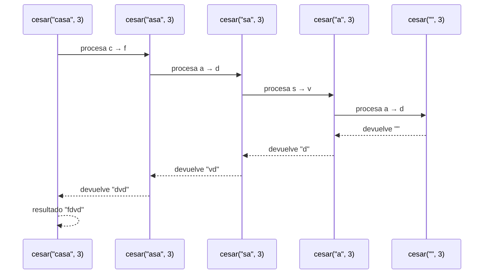
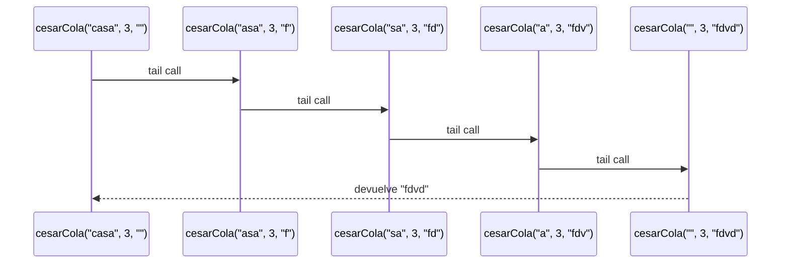
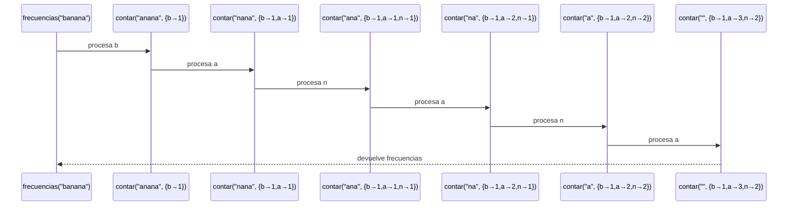
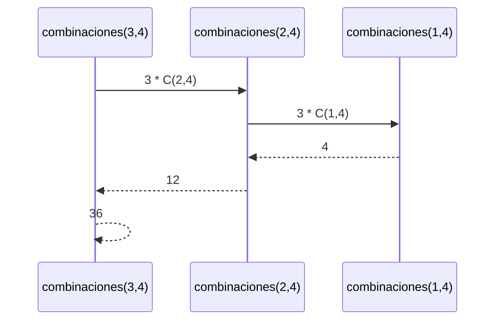
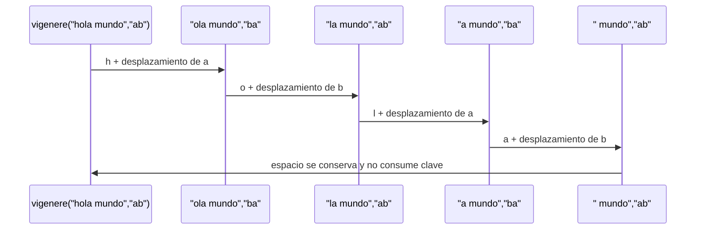

# Informe de Proceso — Cifrados Clásicos con Recursión

## 1. Cifrado César con recursión lineal

### Definición del algoritmo

La función `cesar` permite cifrar un mensaje utilizando el cifrado César. Recibe un mensaje `m` y un desplazamiento `k`.

La función procesa el mensaje carácter por carácter. Si el carácter es una letra minúscula entre `'a'` y `'z'`, se desplaza `k` posiciones dentro del alfabeto. Los demás caracteres se mantienen sin cambios.

```scala
def cesar(m: Mensaje, k: Int): Mensaje = {

  def cifrar(c: Char): Char = {
    if (esMinuscula(c)) {
      val pos = c - 'a'
      val nuevo = ((pos + k) % 26 + 26) % 26
      ('a' + nuevo).toChar
    } else {
      c
    }
  }

  if (m.isEmpty) {
    ""
  } else {
    cifrar(m.head) + cesar(m.tail, k)
  }
}
```

### Caso base

El caso base se presenta cuando el mensaje está vacío:

```scala
if (m.isEmpty) {
  ""
}
```

No quedan caracteres por procesar, por lo que la función devuelve una cadena vacía.

### Caso recursivo

Si el mensaje no está vacío, se toma el primer carácter mediante:

```scala
m.head
```

Este carácter se cifra mediante la función `cifrar`.

Después se procesa recursivamente el resto del mensaje:

```scala
cesar(m.tail, k)
```

El resultado del carácter actual se concatena con el resultado de la llamada recursiva.

### Ejemplo de ejecución

Se utiliza el caso:

```scala
cesar("casa", 3)
```

El desplazamiento es de 3 posiciones:

```text
c → f
a → d
s → v
a → d
```

Por lo tanto:

```text
cesar("casa", 3) = "fdvd"
```

### Llamados de pila

La ejecución se desarrolla de la siguiente manera:

```text
cesar("casa", 3)
    ↓
"f" + cesar("asa", 3)
    ↓
"f" + ("d" + cesar("sa", 3))
    ↓
"f" + ("d" + ("v" + cesar("a", 3)))
    ↓
"f" + ("d" + ("v" + ("d" + cesar("", 3))))
    ↓
"f" + ("d" + ("v" + ("d" + "")))
    ↓
"fdvd"
```

Mientras se realizan estas llamadas, las llamadas anteriores permanecen pendientes porque necesitan esperar el resultado de la llamada recursiva.

### Diagrama de llamados de pila



### Uso de la pila

La función `cesar` utiliza recursión lineal. La llamada recursiva no es la última operación, porque después de obtener su resultado todavía debe realizarse la concatenación:

```scala
cifrar(m.head) + cesar(m.tail, k)
```

Por esta razón, las llamadas anteriores permanecen en la pila mientras se procesa el resto del mensaje.

---

## 2. Cifrado César con recursión de cola

### Definición del algoritmo

La función `cesarCola` realiza el mismo cifrado César que `cesar`, pero utiliza un acumulador `acc` para guardar el resultado parcial.

```scala
@tailrec
final def cesarCola(
    m: Mensaje,
    k: Int,
    acc: Mensaje = ""
): Mensaje = {

  if (m.isEmpty) {
    acc
  } else {
    val c = m.head

    val cCifrado = if (esMinuscula(c)) {
      val desplazamiento =
        ((c.toInt - primera + k) % letras + letras) % letras

      (desplazamiento + primera).toChar
    } else c

    cesarCola(m.tail, k, acc + cCifrado)
  }
}
```

El uso de:

```scala
@tailrec
```

permite que el compilador compruebe que la llamada recursiva se encuentra en posición de cola.

### Caso base

Cuando el mensaje está vacío:

```scala
if (m.isEmpty) {
  acc
}
```

La función devuelve directamente el contenido del acumulador.

### Caso recursivo

Si todavía existen caracteres, se toma el primero:

```scala
val c = m.head
```

Luego se determina su versión cifrada y se agrega al acumulador:

```scala
acc + cCifrado
```

Finalmente se realiza la llamada recursiva:

```scala
cesarCola(m.tail, k, acc + cCifrado)
```

### Ejemplo de ejecución

Se utiliza:

```scala
cesarCola("casa", 3)
```

Como el acumulador comienza vacío:

```text
cesarCola("casa", 3, "")
```

Después de procesar `c`:

```text
cesarCola("asa", 3, "f")
```

Después de procesar `a`:

```text
cesarCola("sa", 3, "fd")
```

Después de procesar `s`:

```text
cesarCola("a", 3, "fdv")
```

Después de procesar `a`:

```text
cesarCola("", 3, "fdvd")
```

Finalmente:

```text
"fdvd"
```

### Llamados de pila

```text
cesarCola("casa", 3, "")
        ↓
cesarCola("asa", 3, "f")
        ↓
cesarCola("sa", 3, "fd")
        ↓
cesarCola("a", 3, "fdv")
        ↓
cesarCola("", 3, "fdvd")
        ↓
"fdvd"
```

A diferencia de `cesar`, cada llamada entrega inmediatamente el resultado parcial mediante el acumulador.

### Diagrama de llamados



### Diferencia con la recursión lineal

En `cesar`, las llamadas anteriores deben esperar el resultado de la siguiente llamada para realizar la concatenación.

En `cesarCola`, el resultado parcial ya está almacenado en `acc` y la llamada recursiva es la última operación.

Por esto, `cesarCola` utiliza recursión de cola y puede ejecutarse utilizando espacio constante de pila.

---

## 3. Cálculo de frecuencias

### Definición del algoritmo

La función `frecuencias` cuenta cuántas veces aparece cada letra minúscula en un mensaje.

Para realizar el recorrido utiliza una función interna llamada `contar`, que recibe:

* El mensaje que falta procesar.
* Un `Map[Char, Int]` con las frecuencias acumuladas.

```scala
@tailrec
def contar(
    mensaje: Mensaje,
    frecuenciasActuales: Map[Char, Int]
): Map[Char, Int]
```

La función solamente cuenta caracteres entre `'a'` y `'z'`.

### Caso base

El caso base ocurre cuando el mensaje está vacío:

```scala
if (mensaje.isEmpty) {
  frecuenciasActuales
}
```

En ese momento se devuelve el mapa con todas las frecuencias encontradas.

### Caso recursivo

Si todavía existen caracteres, se obtiene el primero:

```scala
val caracter = mensaje.head
```

Si es una letra minúscula, se obtiene su cantidad actual:

```scala
val cantidad =
  frecuenciasActuales.getOrElse(caracter, 0)
```

Después se incrementa su frecuencia y se continúa con el resto del mensaje.

Los caracteres que no son letras minúsculas simplemente se ignoran.

### Ejemplo de ejecución

Se utiliza:

```scala
frecuencias("banana")
```

El recorrido produce:

```text
"banana"
    ↓
b → b = 1
    ↓
a → a = 1
    ↓
n → n = 1
    ↓
a → a = 2
    ↓
n → n = 2
    ↓
a → a = 3
```

El resultado sin ordenar sería equivalente a:

```text
b → 1
a → 3
n → 2
```

Después se ordena de mayor a menor frecuencia y, en caso de empate, alfabéticamente:

```text
List(('a', 3), ('n', 2), ('b', 1))
```

### Diagrama



---

## 4. Desplazamiento probable

### Definición del algoritmo

La función `desplazamientoProbable` utiliza las frecuencias del mensaje cifrado para estimar el desplazamiento utilizado por el cifrado César.

Se supone que la letra que aparece con mayor frecuencia corresponde a la letra `'e'` del mensaje original.

Primero se calculan las frecuencias:

```scala
val frecs = frecuencias(m)
```

Si no existen letras, se devuelve `0`.

Si existen letras, se toma la primera de la lista ordenada:

```scala
val letraMasFrecuente = frecs.head._1
```

Finalmente se calcula la distancia entre la letra más frecuente y `'e'`:

```scala
((letraMasFrecuente - 'e') % 26 + 26) % 26
```

### Caso sin letras

Si el mensaje es:

```scala
desplazamientoProbable("123")
```

no existen letras minúsculas, por lo que:

```text
resultado = 0
```

### Ejemplo

Para:

```scala
desplazamientoProbable("hhhaa")
```

la letra más frecuente es `'h'`.

La distancia desde `'e'` hasta `'h'` es:

```text
h - e = 3
```

Por lo tanto:

```text
desplazamientoProbable("hhhaa") = 3
```

---

## 5. Romper el cifrado César

### Definición del algoritmo

La función `romperCesar` utiliza el desplazamiento probable para intentar descifrar automáticamente un mensaje.

Primero obtiene el desplazamiento:

```scala
val desplazamiento = desplazamientoProbable(m)
```

Después aplica el desplazamiento contrario:

```scala
cesar(m, -desplazamiento)
```

### Ejemplo de ejecución

Se considera:

```scala
val original = "el mensaje secreto"
val cifrado = cesar(original, 7)
```

Después se intenta recuperar el mensaje:

```scala
romperCesar(cifrado)
```

La función calcula el desplazamiento probable y utiliza su negativo para descifrar.

Cuando la letra más frecuente realmente corresponde a `'e'`, el método puede recuperar el mensaje original.

### Limitación

El método no garantiza que todos los mensajes puedan recuperarse correctamente.

Esto ocurre porque la frecuencia más alta del mensaje original no necesariamente tiene que ser la letra `'e'`.

Por ejemplo, si otra letra aparece más veces que `'e'`, el algoritmo puede estimar un desplazamiento incorrecto y producir un mensaje diferente al original.

---

## 6. Combinaciones

### Definición del algoritmo

La función `combinaciones` calcula la cantidad de mensajes de longitud `n` que pueden formarse con un alfabeto de `a` letras sin repetir una misma letra consecutivamente.

La definición utilizada es:

```scala
C(0,a) = 1
C(1,a) = a
C(n,a) = (a - 1)C(n-1,a)
```

### Caso base 1

Cuando:

```text
n = 0
```

se devuelve:

```text
1
```

Esto representa el mensaje vacío.

### Caso base 2

Cuando:

```text
n = 1
```

se devuelve:

```text
a
```

porque existe una posibilidad por cada letra del alfabeto.

### Caso recursivo

Para `n > 1`:

```scala
BigInt(a - 1) * combinaciones(n - 1, a)
```

La función calcula el resultado del tamaño anterior y lo multiplica por `a - 1`.

### Ejemplo de ejecución

Para:

```scala
combinaciones(3, 4)
```

la ejecución es:

```text
combinaciones(3, 4)
        ↓
3 * combinaciones(2, 4)
        ↓
3 * (3 * combinaciones(1, 4))
        ↓
3 * (3 * 4)
        ↓
36
```

Por lo tanto:

```text
combinaciones(3, 4) = 36
```

### Diagrama



---

## 7. Cifrado Vigenère

### Definición del algoritmo

La función `vigenere` utiliza una clave que se repite durante el cifrado.

Cada letra de la clave representa un desplazamiento:

```text
a = 0
b = 1
c = 2
...
z = 25
```

La función recibe:

```scala
vigenere(m: Mensaje, clave: Clave)
```

### Caso base

Si el mensaje está vacío:

```scala
if (m.isEmpty) {
  ""
}
```

se devuelve una cadena vacía.

También existe un caso en el que la clave está vacía:

```scala
if (clave.isEmpty) {
  m
}
```

En este caso el mensaje se devuelve sin cambios.

### Caso recursivo

Si el carácter actual es una letra minúscula, se obtiene el desplazamiento correspondiente a la primera letra de la clave:

```scala
val avance = clave.head - 'a'
```

Después se calcula el carácter cifrado.

La clave se actualiza utilizando:

```scala
clave.tail + clave.head
```

De esta forma, la primera letra de la clave pasa al final y la clave vuelve a repetirse.

Si el carácter no es una letra minúscula, se copia sin cambios y la clave no avanza.

### Ejemplo de ejecución

Se utiliza:

```scala
vigenere("ataque", "sol")
```

La clave se repite:

```text
mensaje: a t a q u e
clave:   s o l s o l
```

Los desplazamientos correspondientes son:

```text
s = 18
o = 14
l = 11
```

Aplicando estos desplazamientos se obtiene:

```text
shliip
```

Por lo tanto:

```text
vigenere("ataque", "sol") = "shliip"
```

### Ejemplo con espacios

También se puede utilizar:

```scala
vigenere("hola mundo", "ab")
```

El espacio se copia y no consume una letra de la clave.

Por esta razón la clave continúa de esta forma:

```text
mensaje: h o l a   m u n d o
clave:   a b a b   a b a b a
```

El resultado es:

```text
hplb mvneo
```

### Diagrama



## 8. Comparación de las estrategias de recursión

Durante el desarrollo del taller se utilizan diferentes formas de recursión.

La función `cesar` utiliza recursión lineal. Cada llamada debe esperar el resultado de la siguiente llamada antes de completar la operación de concatenación.

La función `cesarCola` utiliza recursión de cola. El resultado parcial se almacena en el acumulador y la llamada recursiva es la última operación.

La función `frecuencias` también utiliza `@tailrec` en la función `contar`, utilizando un mapa como acumulador.

En `combinaciones`, la llamada recursiva se utiliza directamente para calcular el resultado del problema anterior.

Finalmente, `vigenere` procesa recursivamente el mensaje mientras mantiene la clave que corresponde a cada posición.

En todos los casos, la recursión permite procesar los datos sin utilizar ciclos `for` o `while`, siguiendo el enfoque de programación funcional solicitado en el taller.
